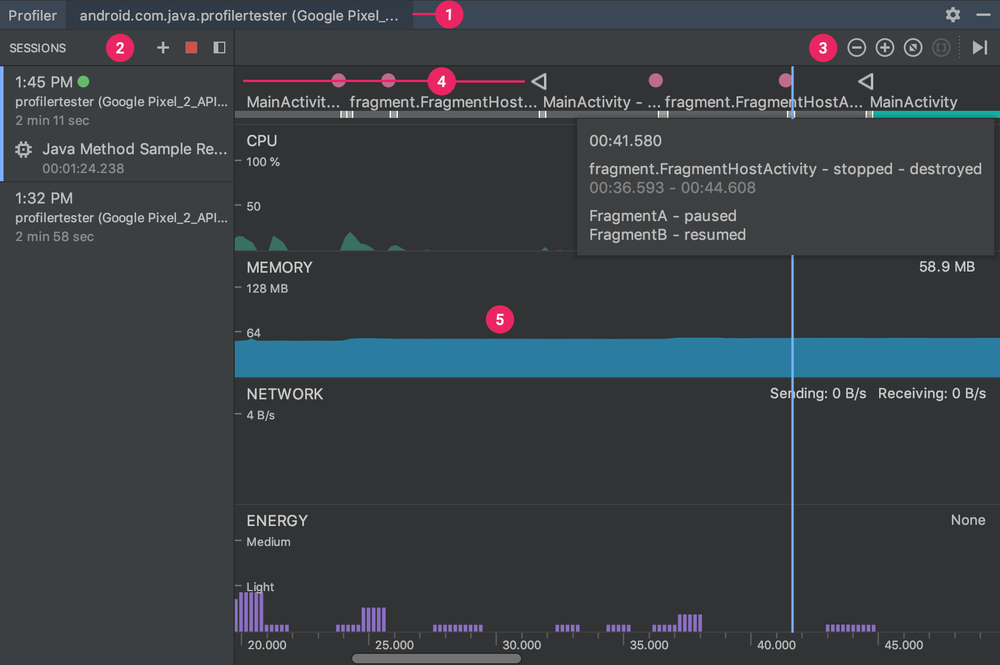
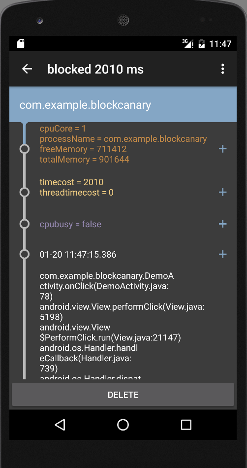
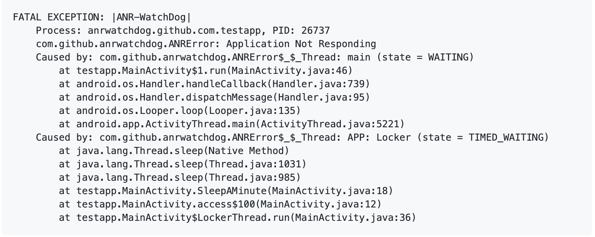

## Android卡顿分析和优化

### 卡顿检测

屏幕渲染丢帧

响应用户交互速度变慢

#### CpuProfiler

https://developer.android.com/studio/profile/android-profiler

AndroidStudio自带

图形化形式展示执行时间，调用栈等

信息全面，包含所有线程

运行时开销严重

使用方式：

```java
//在需要监控的开始地方：
Debug.startMethodTracing("");
//在需要监控的结束地方：
Debug.stopMethodTracing();
```

生成文件在sdcard:Android/data/packageName/files

可视化界面：




#### systrace

https://developer.android.com/topic/performance/tracing

监控和跟踪Cpu调用，线程情况，生成Html报告

Api18以上使用，建议使用TraceCompact

使用方式：

```shell
python systrace.py -t 10 [other-options] [categores]
```

轻量级、直观、提供优化建议

python实现，本地检测，无法带到线上


#### StrictMode

严苛模式，Android提供的一种运行时监控机制，一般在debug模式下使用

方便强大

包含线程策略和虚拟机策略

线程策略：

```java
//监控自定义的方法耗时调度
detectCustomSlowCalls();
//监控磁盘读取操作
detectDiskReads();
//监控网络
detectNetwork();
```

虚拟机策略:

```java
//监控Activity泄漏
detectActivityLeaks();
//监控Sqlite对象泄漏
detectLeakedSqliteObjects();
//限制类的实例数量
setClassInstanceLimit();
```


#### AndroidPerformacneMonitor库

github：https://github.com/markzhai/AndroidPerformanceMonitor

又叫Block-Canary

可以带到线上监控

原理：自定义主线程handler的logging

监控主线程Handler处理Message的时间

找到检测的时机

采集堆栈信息并上报




### ANR

#### ANR分类

KeyDispatchTimeout 5s（响应用户操作）

BroadcastTimeout 前台10s 后台60s （广播）

ServiceTimeout 前台20s，后台200s （服务）


#### adb命令实现ANR分析

ANR发生后会把日志输出在：data/anr/trace.txt

获取日志：

```shell
adb pull data/anr/trace.txt
```

分析堆栈信息，找到CPU、IO或其他原因

无法带到线上


#### ANR-WatchDog库

github：https://github.com/SalomonBrys/ANR-WatchDog

开源、无侵入

继承Thread类

原理：start->run方法中while循环->post一个runnable到主线程，执行值修改操作->sleep一段时间后判断值有没有修改->如果ANR发生默认抛出异常。




界面秒开

Systrace分析Cpu利用率

异步+延时进行优化

异步渲染

xml转换成java代码，

绘制优化

提前获取页面数据

Lancet：

轻量级AOP框架

编译速度快，增量编译

API简单，没有多余代码插入APK

@Proxy ：对系统API进行Hook

@Insert： 用于操作APP类和第三方库的类


统计界面打开时长

hook Activity的onCreate()方法和onWindowFocusChange()方法，得到界面打开时长；

hook Activity的其他生命周期回调，分析每个生命周期回调的耗时；

定制Handler，统计延时加载：复写sendMessageAtTime()得到调用堆栈和handleMessage()统计消息处理时长；

定制Gradle插件，编译时把所有Handler替换成定制的Handler；


