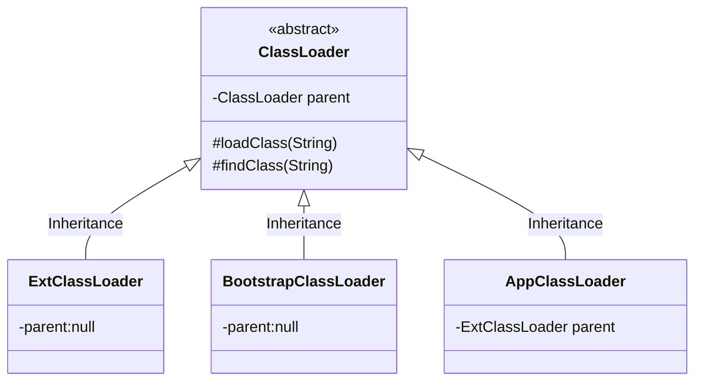
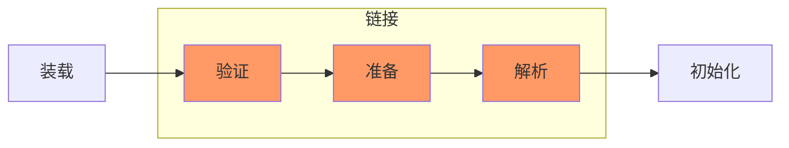

jvm中的类加载器

双亲委派模式（Parents Delegation Model）

ExtClassLoader和BootstrapClassLoader的parent都是nul，AppClassLoader的parent是ExtClassLoader，

AppClassLoader加载类时，会先通过ExtClassLoader加载，如果加载失败，则通过BootstrapClassLoader加载，如果还是失败，才会通过AppClassLoader自己去加载。在这里可以把ExtClassLoader和BootstrapClassLoader理解成AppClassLoader的“双亲”。

> 注意：“双亲委派”机制只是 Java 推荐的机制，并不是强制的机制。我们可以继承 java.lang.ClassLoader 类，实现自己的类加载器。如果想保持双亲委派模型，就应该重写` findClass(name) `方法；如果想破坏双亲委派模型，可以重写 `loadClass(name) `方法。

自定义 ClassLoader 步骤

1. 自定义一个类继承抽象类 ClassLoader。

2. 重写` findClass()` 方法。

3. 在 `findClass ()`中，调用 `defineClass() `方法将字节码转换成 Class 对象，并返回。

Android中的类加载器

BaseDexClassLoader

加载dex

子类PathClassLoader

默认加载安装到手机的APK或jar中类

子类DexClassLoader，parnet一般传PathClassLoader

很明显，对比 PathClassLoader 只能加载已经安装应用的 dex 或 apk 文件，DexClassLoader 则没有此限制，可以从 SD 卡上加载包含 class.dex 的 .jar 和 .apk 文件，这也是插件化和热修复的基础，在不需要安装应用的情况下，完成需要使用的 dex 的加载。

类加载过程

